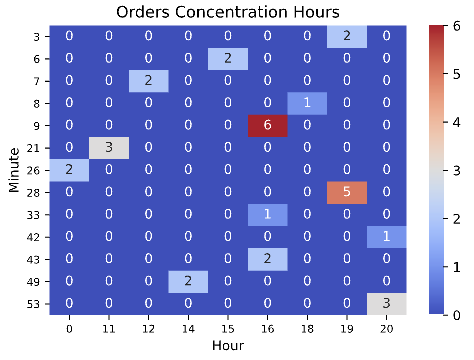

# Overview
Collection of scripts to play with data.

# Prerequisite
Following prerequisites should be satisfied in order to run successfully the project:

- Python 3.x.
- SQLite
- All dependencies installed.

## Dependencies Installation
To install the dependencies, type the following command from the prompt.

```bash
$> pip install -r requirements
```

## SQLite Installation
Follow the instructions from the [download page](https://www.sqlite.org/download.html) according to your environment.

# Scripts

## ```orders-exporter.py```
Exports orders from the JSON format to the CSV and optionally to a SQLite database.

It requires an API key in input:

```bash
$> python orders-exporter.py
usage: orders-exporter.py [-h] -k KEY [-l LOCALE] [-d] -p PATH -n NUMBER
orders-exporter.py: error: the following arguments are required: -k/--key, -p/--path, -n/--number
```

```bash
$> python orders-exporter.py --help
usage: orders-exporter.py [-h] -k KEY [-l LOCALE] [-d] -p PATH -n NUMBER

Incrementally exports JSON orders data into CSV format and optionally into a SQLite DB.

optional arguments:
  -h, --help            show this help message and exit
  -k KEY, --key KEY     API key to be used to perform the REST request to the backend
  -l LOCALE, --locale LOCALE
                        Specify the locale: it_IT for italian. Otherwise machine default one.
  -d, --db              Instruct the tool to load a SQLite database up
  -p PATH, --path PATH  Define datastore base path (CSV and SQLite archive will be based out of it)
  -n NUMBER, --number NUMBER
                        Define how many records each REST call should pull down
```

To run it succssfully:

```bash
$> python orders-exporter.py -k <specific_api_key> -k en_EN -d -p <db_path> -n <nr_records_desired>
info: loaded orders...
[...]
info: export successul
```

## ```orders-dbdumper.py```
Exports all orders from the JSON format to the CSV and successively to a SQLite database.


It requires an API key in input:
```bash
$> python orders-dbdumper.py
usage: orders-dbdumper.py [-h] -k KEY [-l LOCALE] -p PATH
orders-dbdumper.py: error: the following arguments are required: -k/--key, -p/--path
```

```bash
$> python orders-dbdumper.py --help
usage: orders-dbdumper.py [-h] -k KEY [-l LOCALE] -p PATH

Exports all JSON orders data into CSV format and optionally into a SQLite DB.

optional arguments:
  -h, --help            show this help message and exit
  -k KEY, --key KEY     API key to be used to perform the REST request to the backend
  -l LOCALE, --locale LOCALE
                        Specify the locale: it_IT for italian. Otherwise machine default one.
  -p PATH, --path PATH  Define datastore base path (CSV and SQLite archive will be based out of it)
```

To run it succssfully:

```bash
$> python orders-exporter.py -k <specific_api_key> -k en_EN -d -p <db_path>
info: loaded orders...
[...]
info: CSV export successul 4381 order(s)
warning: 3328 row(s) were duplicated: update was made
info: SQLite loaded successfully with 4381 record(s)
```

# Notebooks

## ```heatmap.ipynb```
Makes use of the SQLite data to plot a Heatmap which shows the concentration of orders during the day.


