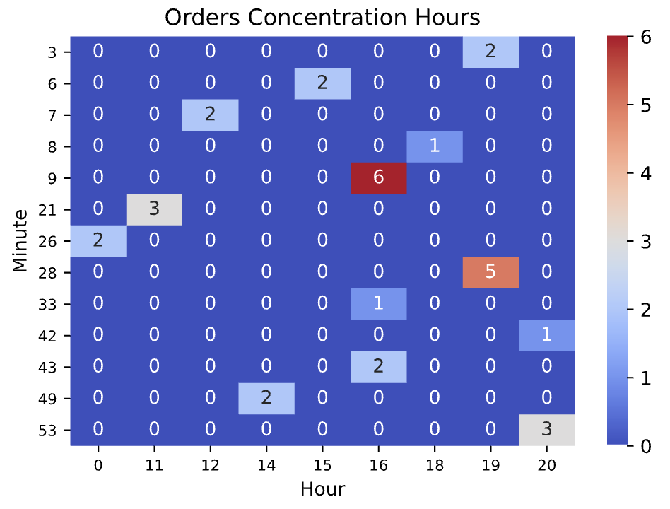

# Overview
Collection of scripts to play with data.

# Prerequisite
Following prerequisites should be satisfied in order to run successfully the project:

- Python 3.x.
- SQLite
- All dependencies installed.

## Dependencies Installation
To install the dependencies, type the following command from the prompt.

```
$> pip install -r requirements
```

## SQLite Installation
Follow the instructions from the [download page](https://www.sqlite.org/download.html) according to your environment.

# Scripts

## ```orders-exporter.py```
Exports orders from the JSON format to the CSV and optionally to a SQLite database.

It requires an API key in input:

```
$> python orders-exporter.py
usage: orders-exporter.py [-h] -k KEY [-l LOCALE] [-d] [-p PATH]
orders-exporter.py: error: the following arguments are required: -k/--key
```

```
$> python orders-exporter.py --help
usage: orders-exporter.py [-h] -k KEY [-l LOCALE] [-d] [-p PATH]

Exports JSON orders data into CSV format.

optional arguments:
  -h, --help            show this help message and exit
  -k KEY, --key KEY     API key to be used to perform the REST request to the backend
  -l LOCALE, --locale LOCALE
                        Specify the locale: it_IT for italian
  -d, --db              Instruct the tool to load a SQLite database up
  -p PATH, --path PATH  Define the path pointing to the DB. If not specifcied, ./db/ is used
```

To run it succssfully:

```
$> python orders-exporter.py -k <specific_api_key> -k en_EN -d -p <db_path>
info: loaded orders...
[...]
info: export successul
```

# Notebooks

## ```heatmap.ipynb```
Makes use of the SQLite data to plot a Heatmap which shows the concentration of orders during the day.


